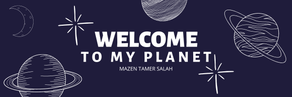

# Mazen Tamer Salah

> Flutter Developer | App & Web Development | Communication & Electronics Engineering

## Summary

Motivated Flutter Developer with a strong interest in app and web development. Currently pursuing a bachelor's degree in Communication and Electronics Engineering. Experienced in Flutter development through Udemy courses, internships, and graduation projects. Proficient in teaching programming courses and contributing to innovative projects. Seeking new opportunities to apply skills and collaborate on exciting ventures.

## Skills

## Experience

- Flutter Developer Intern, GammalTech (2020)
- ECPC Participant, Arab Academy for Science, Technology (2022)
- Cisco Cybersecurity Intern, National Telecommunication Institute (NTI) (2022)
- Programming Instructor (2021)

## Graduation Projects

1. **Smart Glove for Deaf People**
   - Developed a Flutter text-to-speech app with Arduino-based smart glove
   - Facilitated communication for deaf individuals
   - 
   - [Documentation](https://drive.google.com/file/d/1oRoYaCMkF89TyWJn-Sb1IiwUTdisximN/view?usp=sharing)

2. **Antibiotics Dosing Calculator**
   - Android app for accurate antibiotic dosage calculation
   - AI companion for doctors
   - 
   - [Play Store](https://play.google.com/store/apps/details?id=com.summationWorks.antiobioCare) | [Web App](http://antibio-care.web.app/)

---

Thank you for visiting my GitHub profile! Feel free to explore my repositories and projects. Let's connect and collaborate on exciting ventures. Reach out to me via email or LinkedIn for more information.

Let's build something remarkable together! 🚀
